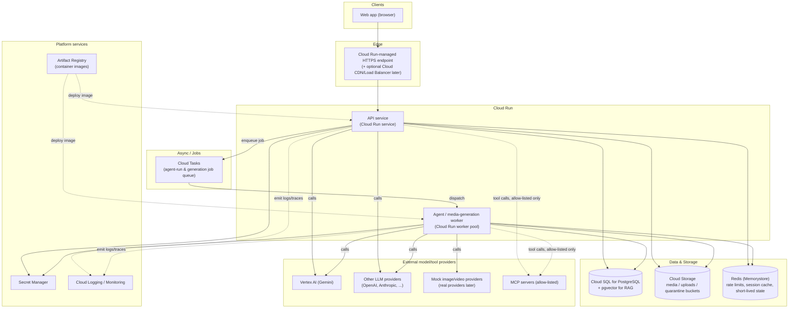

# 18. Cloud Architecture (Google Cloud) — Plan, Not Yet Provisioned

**Status: planning document, now backed by real Dockerfiles + Terraform (Phase 14, 2026-09-02 —
see [[26_DECISIONS]] ADR-037; §1.1's recommended Worker Pool for the job worker added 2026-09-03,
ADR-039; §1.4's Cloud Storage now actually used for generated assets, ADR-040; a `clamav/clamav`
malware-scanning sidecar on the worker pool, ADR-042), still not provisioned.** No GCP project, billing account, or budget
currently exists for this platform, and nothing described here (or in `infrastructure/`) should be
provisioned until the team has both. Where the doc says "recommended," it means "recommended once
you provision," not "provision now." **Two real divergences from this document's §1.5/§2, found
while building the actual IaC**: the system that was actually built uses pg-boss directly on
Postgres (ADR-012/ADR-027), not Cloud Tasks, and uses no distributed cache at all (rate limiting is
in-process, ADR-032), so `infrastructure/terraform/` does not provision Cloud Tasks or Memorystore
— provisioning either would pay for infrastructure nothing in this codebase calls. See ADR-037 for
the full reasoning, the Dockerfiles, and the deployment runbook.

Local development in the meantime must not hard-require any of this. See §6 for the local-dev
implication and the setup gap it creates.

This document evaluates Google Cloud because Vertex AI/Gemini is a target model provider for the
platform, but the architecture is deliberately container-based (Cloud Run + standard Postgres/
Redis/object-storage primitives) so it is not a one-way door into GCP lock-in — the same
containers could run on another cloud or on-prem if that becomes the better choice later.

---

## 1. Service-by-service evaluation

For each service: what it is, why it would or wouldn't be included, and when (if ever) to revisit.

### 1.1 Cloud Run — **include**

Fully managed serverless containers; you supply a container image, Google handles provisioning,
scaling (including to zero), and load balancing.

- **Why include**: This is the right default for the API service, the web frontend (if
  server-rendered), and the background worker(s) that process agent runs and media-generation
  jobs. It is the cheapest option at low/variable traffic because it scales to zero and bills per
  request/CPU-second, and it has the least operational overhead of any compute option Google
  offers — no cluster to patch, no node pool to size. As of 2026, Cloud Run also supports **Jobs**
  (run-to-completion tasks, good fit for one-off batch work) and **Worker Pools**, which reached
  GA in April 2026 and are purpose-built for non-HTTP background processing (queue consumers) —
  reportedly ~40% cheaper than request-driven services/jobs for sustained background work. Cloud
  Run also now supports GPU attachment (NVIDIA L4, and RTX PRO 6000 Blackwell as of April 2026) if
  the platform ever needs to self-host a model or run GPU-bound media generation instead of
  calling a hosted provider.
- **Fit for this platform**: API service → Cloud Run **service**; agent/job worker that consumes
  the task queue → Cloud Run **worker pool** (not a service, since it isn't handling inbound HTTP);
  one-off maintenance/migration scripts → Cloud Run **jobs**.
- Sources: https://docs.cloud.google.com/run/docs/overview/what-is-cloud-run,
  https://cloud.google.com/blog/products/serverless/whats-new-for-cloud-run-at-next26,
  https://docs.cloud.google.com/run/docs/configuring/jobs/gpu

### 1.2 GKE (Google Kubernetes Engine) — **exclude for now, revisit later**

Fully managed Kubernetes control plane; you own scheduling, networking, and node configuration in
much more depth than Cloud Run.

- **Why exclude now**: GKE is justified when you need things Cloud Run genuinely cannot do:
  fine-grained custom scheduling/bin-packing, stateful workloads with complex storage topologies,
  advanced networking (custom CNI, service mesh across many microservices), GPU needs beyond what
  Cloud Run's managed GPU support covers, or you're already running "many microservices that
  benefit from a shared platform." None of that describes this platform at launch: a handful of
  services (API, worker, web) with standard HTTP/queue communication patterns is precisely Cloud
  Run's sweet spot, and GKE would add a real ongoing operational burden (cluster upgrades, node
  pool management, RBAC/networking configuration) that has no corresponding benefit yet.
  Cloud Run and GKE are commonly described as complementary rather than exclusive — a team can
  start on Cloud Run and move specific workloads to GKE later if a genuine need appears.
- **When to revisit**: if the platform later needs a large number of independently-scaled
  microservices with complex inter-service networking, or sustained high-utilization compute where
  GKE's cost efficiency at scale (with committed-use discounts) starts to beat Cloud Run's
  per-request pricing, or workloads Cloud Run's execution model doesn't fit well (long-lived
  stateful GPU clusters for self-hosted model serving at scale).
- Source: https://docs.cloud.google.com/kubernetes-engine/docs/concepts/gke-and-cloud-run

### 1.3 Cloud SQL for PostgreSQL — **include**; AlloyDB — **exclude for now**

- **Cloud SQL for Postgres — include**: This is the primary relational store (users,
  organizations, conversations, agent runs, tool-call logs, RAG document metadata). It is the
  standard, cost-effective managed Postgres option and is the right default for a small-to-medium
  workload — a starting instance is inexpensive relative to AlloyDB, and it is operationally
  identical to any Postgres the team already knows, which matters given no cloud infra is running
  yet. Enable automated backups, point-in-time recovery, and a read replica once traffic justifies
  it.
- **AlloyDB — exclude for now**: AlloyDB is a Postgres-compatible engine built for
  performance-intensive/analytical (HTAP) workloads at scale, but its smallest cluster costs
  roughly 20-25x Cloud SQL's smallest instance, which is not justifiable before there is production
  load to justify it. Revisit only if the platform develops genuinely demanding read/analytical
  workloads (e.g., heavy in-database analytics over agent-run history) that Cloud SQL measurably
  can't keep up with.
- **Vector search note**: `pgvector` runs on both Cloud SQL and AlloyDB. For this platform's RAG
  needs, starting with `pgvector` on the same Cloud SQL instance (rather than standing up a
  separate vector database) keeps the architecture minimal; move to a dedicated vector store only
  if query volume/latency requirements outgrow it.
- Sources: https://www.bytebase.com/blog/alloydb-vs-cloudsql/,
  https://www.doit.com/blog/when-to-use-alloydb-instead-of-cloud-sql-for-postgresql

### 1.4 Cloud Storage — **include**

Object storage for image/video generation outputs, uploaded documents (RAG ingestion, chat
attachments), and coding-agent workspace artifacts that need to persist past a sandbox's lifetime.

- **Why include**: There's no viable alternative for holding binary media/document assets at
  scale — this is a straightforward, low-risk inclusion. Use separate buckets (or prefixes with
  distinct IAM bindings) for: generated media outputs, user-uploaded documents, and a
  short-lived quarantine bucket for uploads pending malware scanning (see
  `13_SECURITY_ARCHITECTURE.md` §12). Serve assets via signed URLs, not public buckets.
  **As built ([[26_DECISIONS]] ADR-042):** no quarantine bucket — quarantine is a document
  *status* (`scanning`: never ingested, never served) enforced in the application, and an
  infected object is deleted outright rather than promoted anywhere; one media bucket with
  per-kind prefixes suffices. Assets are streamed through the API rather than served via
  signed URLs (ADR-040), a deliberate deferral until asset sizes justify it.

### 1.5 Pub/Sub vs. Cloud Tasks — **include Cloud Tasks now; add Pub/Sub only if a fan-out need appears**

Google's own guidance frames the choice as **implicit vs. explicit invocation**: Pub/Sub
decouples publishers from subscribers entirely (a publisher just publishes; it doesn't know or
control who consumes it, and any number of subscribers can independently receive the same
event) — good for general event distribution/fan-out. Cloud Tasks is for **explicit invocation**:
the producer controls exactly which endpoint handles the task, with precise per-task retry/backoff
and rate-limiting/scheduling control.
(https://docs.cloud.google.com/tasks/docs/comp-pub-sub)

- **This platform's job queue (agent runs, image/video generation jobs) is a textbook Cloud Tasks
  fit**: each job has one, well-known consumer (the worker pool), and the platform wants precise
  control over per-tenant concurrency, retry limits, and dispatch rate — exactly what Cloud Tasks
  is built for. Starting with Cloud Tasks alone avoids taking on Pub/Sub's operational surface
  (topics, subscriptions, dead-letter topic wiring) before there's a need for multi-consumer
  fan-out.
- **Add Pub/Sub later if/when** the platform needs genuine event fan-out — e.g., "a generation job
  completed" needs to simultaneously notify a websocket-push service, an analytics pipeline, and a
  billing-usage recorder, with each subscriber independent and addable without touching the
  publisher. That's the point at which Pub/Sub's decoupling earns its complexity; it would be
  premature now.
- Source: https://docs.cloud.google.com/pubsub/docs/choosing-pubsub-or-cloud-tasks

### 1.6 Secret Manager — **include**

- **Why include**: This is a small, low-cost, high-value inclusion with no credible alternative
  once running on GCP — API keys for LLM/image/video providers, database credentials, and signing
  keys all belong here rather than in environment variables baked into a container image or
  deploy config. Cloud Run services/jobs mount secrets directly from Secret Manager at runtime.
  See `13_SECURITY_ARCHITECTURE.md` §3 for the full secret-handling policy.
- Source: https://docs.cloud.google.com/secret-manager/docs/best-practices

### 1.7 Artifact Registry — **include**

- **Why include**: Required, not optional, the moment you deploy containers to Cloud Run —
  Artifact Registry is where built container images live, with vulnerability scanning on push and
  IAM-scoped access. There's no meaningful alternative within GCP (it superseded Container
  Registry). Cost is negligible at this scale (storage + minimal image-scanning cost).

### 1.8 Cloud Build — **include, but treat as swappable**

- **Why include (conditionally)**: Cloud Build is a reasonable default CI/CD runner for
  build-and-push-to-Artifact-Registry-and-deploy-to-Cloud-Run pipelines, and it integrates
  natively with the rest of this stack (no cross-cloud auth to wire up). However, if the team is
  already using GitHub Actions (common, and free/cheap for a small team's usage volume) for CI,
  it is entirely reasonable to keep tests/lint/build in GitHub Actions and use it to trigger a
  Cloud Run deploy via `gcloud run deploy` or the GitHub Actions `google-github-actions/deploy-
  cloudrun` action, rather than duplicating pipeline logic in Cloud Build. **Recommendation**:
  default to GitHub Actions for CI (matches the "no cost until needed" posture and keeps CI
  config next to code) and only adopt Cloud Build if a specific need for GCP-native build
  triggers/IAM-scoped builds emerges.

### 1.9 Vertex AI — **include, specifically for Gemini access; do not include Vertex's broader ML-ops surface**

Vertex AI is Google's umbrella ML platform; it is also the enterprise-grade access path to Gemini
models (as distinct from calling the Gemini Developer API directly with a simple API key).

- **Why include (narrowly)**: Since Gemini is a target provider for this model-agnostic platform,
  Vertex AI is the right access path when the platform is deployed on GCP: it gives tighter IAM
  integration (service-account auth instead of a bare API key), org-level data-residency controls,
  context caching at a 90% discount, and batch-API pricing at a 50% discount versus synchronous
  calls — all useful for a cost-sensitive agent platform that will make many repeated/cacheable
  calls. Base token pricing on Vertex's global endpoint matches the plain Gemini Developer API
  (e.g., Gemini 2.5 Pro at $1.25/M input, $10/M output tokens for ≤200K context as of mid-2026);
  regional/data-residency endpoints carry roughly a 10% uplift as of July 2026.
- **Why exclude the rest of Vertex AI's surface for now**: Vertex AI also offers a large ML-ops
  suite — custom training pipelines, feature store, model registry/monitoring for
  self-trained models, AutoML, notebooks. None of that is relevant yet: this platform calls
  hosted third-party model providers (Gemini via Vertex, OpenAI, Anthropic, etc.) through its own
  provider-adapter abstraction; it is not training or hosting its own models. Adopting the rest of
  Vertex's surface now would be scope creep with no near-term payoff.
- Because the platform is explicitly model-agnostic, the Vertex/Gemini adapter is one interchangeable
  provider behind the same abstraction as OpenAI/Anthropic/mock adapters — Vertex AI is a provider
  choice, not a platform dependency.
- Sources: https://cloud.google.com/vertex-ai/pricing, https://www.cloudzero.com/blog/gemini-pricing/

### 1.10 Cloud Logging / Cloud Monitoring — **include (as the GCP-native leg of the observability plan)**

- **Why include**: Cloud Run services/jobs emit stdout/stderr to Cloud Logging automatically with
  zero extra setup, and structured JSON logs (see `20_OBSERVABILITY.md`) are automatically parsed
  into queryable fields. Cloud Monitoring provides the dashboards/alerting layer for
  infrastructure-level signals (Cloud Run instance count, CPU/memory, Cloud Tasks queue depth,
  Cloud SQL connections). Combined with the OpenTelemetry-based application tracing/metrics
  described in `20_OBSERVABILITY.md`, this is a "batteries included, no extra service to run"
  starting point once deployed on GCP. See `20_OBSERVABILITY.md` for the full design, including how
  it maps to the self-hosted Grafana/Loki/Tempo alternative used for local development.

---

## 2. Recommended minimal-to-start architecture

The following is the recommended architecture **for the day the team has a GCP project and
budget** — not something to provision today.

Notes on the diagram:

- **Coding-agent sandbox is deliberately not drawn as a GCP-managed component yet.** Where and how
  it runs (Cloud Run sandboxed execution, a self-hosted microVM pool, or a managed third-party
  sandbox service) is an implementation decision under `13_SECURITY_ARCHITECTURE.md` §6 that
  should be made once the coding agent's concrete execution requirements are known, and is
  intentionally left open here rather than pre-decided.
- **Redis (Memorystore)** is included as a lightweight, general-purpose fast-cache/rate-limit
  store; it is small enough to justify at day one alongside Cloud SQL and Cloud Tasks, unlike the
  heavier services deferred above.
- No load balancer, CDN, multi-region, or VPC Service Controls setup is included at this stage —
  Cloud Run's built-in HTTPS endpoint is sufficient until there's a concrete need (custom domain
  + CDN caching for static assets is a likely first addition, not a day-one requirement).

## 3. Explicitly deferred / excluded at this stage

| Service | Status | Revisit when |
|---|---|---|
| GKE | Excluded | Need complex multi-service scheduling/networking or GPU/stateful workloads beyond Cloud Run's model |
| AlloyDB | Excluded | Cloud SQL demonstrably can't meet a real performance/analytics requirement |
| Pub/Sub | Excluded | Need genuine multi-subscriber event fan-out beyond the single-consumer job queue |
| Cloud Build | Deferred to GitHub Actions | A concrete need for GCP-native build triggers/IAM-scoped builds appears |
| Vertex AI's broader ML-ops suite (training, feature store, AutoML) | Excluded | The platform starts training/hosting its own models rather than calling third-party providers |
| Cloud CDN / global Load Balancer | Excluded | Traffic/latency profile justifies edge caching or multi-region routing |
| VPC Service Controls / dedicated VPC networking | Deferred | Compliance requirement or need to fully lock down egress at the network layer (complements, doesn't replace, the sandbox egress controls in the security doc) |

## 4. Cost posture and provisioning discipline

- **Do not create a GCP project, enable billing, or provision any resource described here until
  the team has an approved budget.** This document is the plan to execute against once that
  happens, not a to-do list to start today.
- When provisioning does begin: set a **budget alert** in Cloud Billing before creating any other
  resource, start every service at its smallest tier (Cloud Run min-instances = 0, smallest Cloud
  SQL tier, Memorystore basic tier), and only increase capacity in response to observed load —
  everything in the §2 diagram scales to (near) zero cost at zero traffic except the always-on
  minimums of Cloud SQL and Memorystore, which is why those two are the ones to double-check
  against the approved budget specifically before creating them.
- Prefer Cloud Run's scale-to-zero for the API and worker so idle periods (e.g., pre-launch,
  internal testing) cost effectively nothing beyond the database/cache instances.

## 5. Provider-agnostic model calls

Because the platform is explicitly model-agnostic, the Vertex AI integration described in §1.9
sits behind the same internal "model provider adapter" interface as every other provider (OpenAI,
Anthropic, local/mock). No part of the core agent loop, tool-calling logic, or RAG pipeline should
import a GCP-specific SDK directly — only the Vertex adapter implementation does. This keeps the
cloud-provider choice in §2 reversible: if the team later prefers to run compute elsewhere while
still calling Gemini via the plain Developer API (rather than through Vertex), that is a
provider-adapter-level change, not an architecture rewrite.

## 6. Local development gap to flag now

Neither Docker nor the `gcloud` CLI is currently installed on the development machine, and this
architecture assumes containerized deployment (Cloud Run) plus GCP tooling for anything beyond
local `.env`-based development. This is a **setup gap, not an assumption to code around**:

- **Docker Desktop (or an equivalent container runtime)** should be added as a documented
  prerequisite before the team needs to (a) build/test the container images this architecture
  deploys, or (b) run integration tests that depend on ephemeral Postgres/Redis containers via
  Testcontainers (see `21_TESTING_STRATEGY.md`). Local application development (API, worker logic)
  can proceed without it in the meantime using a local Postgres/Redis install or free-tier hosted
  instances for day-to-day coding, but container-based integration testing and any Cloud Run
  deploy will block until Docker is installed.
- **`gcloud` CLI** is only needed once there is an actual GCP project to point it at — it should
  not be installed or configured speculatively. Add it to setup docs as a step that happens
  together with GCP project creation, not before.
- Track both as open setup TODOs rather than silently assuming either is present; nothing in the
  local dev workflow (`README`/dev-setup docs, outside the scope of this file) should require
  Docker or `gcloud` until the corresponding feature (containerized integration tests, or an actual
  cloud deploy) is actually being worked on.
