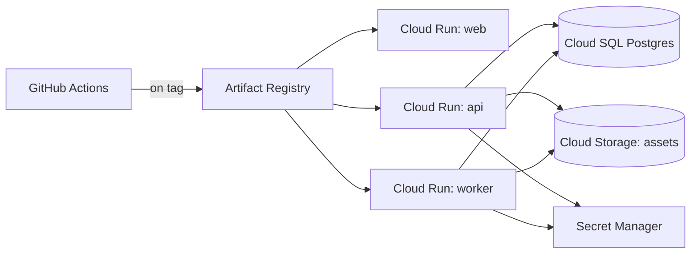

# Deployment Architecture

Covers local dev through the (currently unauthorized/unprovisioned, per [[26_DECISIONS]] ADR-011) cloud target from [[18_CLOUD_ARCHITECTURE]]. Nothing in this document is applied automatically — see the "Provisioning gate" section at the end.

## Local development (Phase 1–5: zero external services)

Per ADR-006/NFR-010: `git clone` → `npm install` → `npm run dev` starts `apps/web` + `apps/api` against SQLite, no Docker, no cloud account, no API keys required (mock LLM provider by default). This is a hard requirement checked at the end of Phase 1, not an aspiration.

## Local development (Phase 6+: Postgres required)

Once RAG/memory (pgvector) and jobs (pg-boss) land, local dev needs a real Postgres instance. Two documented options, since Docker is not currently installed on this dev machine ([[27_RISKS_AND_LIMITATIONS]]):

1. **Docker Compose** (`infrastructure/docker-compose.yml`, Postgres with the pgvector extension image) — the standard path once Docker Desktop is installed; one command (`docker compose up -d`) brings up the dependency.
2. **Hosted free-tier Postgres** (e.g. Neon) via `DATABASE_URL` — a no-install fallback that works identically since the app only ever talks to a Postgres connection string, never to "Docker" as a concept.

No Redis is needed in either case ([[26_DECISIONS]] ADR-012 — pg-boss runs on the same Postgres instance).

## Containerization

One `Dockerfile` per deployable app (`apps/web`, `apps/api`, `apps/worker`) in `infrastructure/docker/`, multi-stage (build stage with full devDependencies → slim runtime stage), each producing an image small enough for fast Cloud Run cold starts (a specific reason Drizzle over Prisma was chosen, ADR-005 — no separate query-engine binary to bundle).

## CI pipeline (GitHub Actions, runs regardless of cloud provisioning status)

```
on: push / pull_request
1. install (npm ci)
2. lint
3. typecheck
4. unit + integration tests (Testcontainers spins up ephemeral Postgres; mock providers only — no paid API calls, per docs/21_TESTING_STRATEGY.md's production-mock guard)
5. build (all apps)
6. docker build (all Dockerfiles) — build-only in CI; push/deploy is a separate, manually-gated job
```

Steps 1–5 have no dependency on any cloud account and run identically for any contributor. Step 6 validates the images build; it does not push to a registry or deploy anywhere without the provisioning gate below being satisfied first.

## Cloud deployment (target design, NOT provisioned — see [[18_CLOUD_ARCHITECTURE]] for service selection)



- **Environments:** `staging` and `production` as separate Cloud Run services + separate Cloud SQL instances (or separate databases on one instance for staging, to control cost pre-scale) — never share a database between environments.
- **Migrations:** run as a one-off Cloud Run Job (`drizzle-kit migrate`) triggered before the new API revision receives traffic, not as an API-boot side effect (avoids N concurrent API instances racing to migrate).
- **Rollback:** Cloud Run's revision model makes rollback a traffic-split change (route 100% back to the previous revision) — no rebuild needed. Database migrations are written additive/backward-compatible where feasible (per [[23_FAILURE_RECOVERY]]) so a code rollback doesn't require a matching down-migration under time pressure.
- **Secrets:** every provider API key, the database URL, and session signing secret are Secret Manager references injected as env vars at deploy time — never baked into an image or committed ([[13_SECURITY_ARCHITECTURE]], NFR-001).

## Environment variables (reference; see `.env.example` once Phase 1 scaffolding exists)

| Variable | Required from | Purpose |
|---|---|---|
| `DATABASE_URL` | Phase 6 | Postgres connection string (unset in Phase 1–5, SQLite is file-based) |
| `SESSION_SECRET` | Phase 1 | Session cookie signing (ADR-008) |
| `ANTHROPIC_API_KEY` | Phase 2 (optional) | Enables real Anthropic adapter |
| `OPENAI_API_KEY` | Phase 2 (optional) | Enables real OpenAI adapter |
| `GOOGLE_API_KEY` / `GOOGLE_APPLICATION_CREDENTIALS` + `GOOGLE_CLOUD_PROJECT` | Phase 2 (optional) | Enables real Gemini/Vertex adapter |
| `OBJECT_STORAGE_*` | Phase 6+ | Local filesystem adapter by default; GCS config once cloud-deployed |
| `NODE_ENV` | always | Gates ADR-013's mock-provider production guard |

## Provisioning gate

No `terraform apply`, `gcloud deploy`, `gcloud sql instances create`, or equivalent is run as part of this engineering effort. This document, [[18_CLOUD_ARCHITECTURE]], and the IaC files in `infrastructure/` are the deliverable for Phase 14 — a real deployment requires the user to explicitly authorize provisioning once a GCP project/billing account exists ([[26_DECISIONS]] ADR-011).
