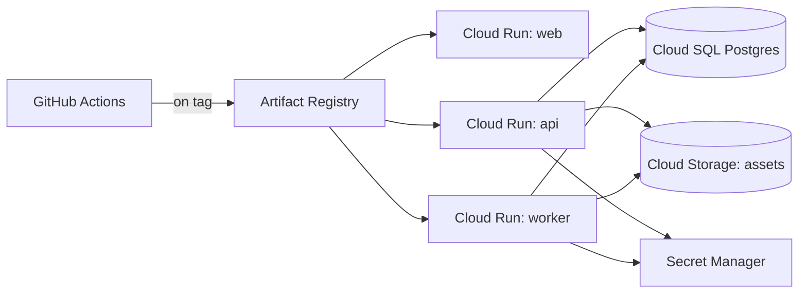

# Deployment Architecture

Covers local dev through the (currently unauthorized/unprovisioned, per [[26_DECISIONS]] ADR-011) cloud target from [[18_CLOUD_ARCHITECTURE]]. Nothing in this document is applied automatically — see the "Provisioning gate" section at the end.

## Local development (Phase 1–5: zero external services)

Per ADR-006/NFR-010: `git clone` → `npm install` → `npm run dev` starts `apps/web` + `apps/api` against SQLite, no Docker, no cloud account, no API keys required (mock LLM provider by default). This is a hard requirement checked at the end of Phase 1, not an aspiration.

## Local development (Phase 6+: Postgres required)

Once RAG/memory (pgvector) and jobs (pg-boss) land, local dev needs a real Postgres instance. Two documented options, since Docker is not currently installed on this dev machine ([[27_RISKS_AND_LIMITATIONS]]):

1. **Docker Compose** (`infrastructure/docker-compose.yml`, Postgres with the pgvector extension image) — the standard path once Docker Desktop is installed; one command (`docker compose up -d`) brings up the dependency.
2. **Hosted free-tier Postgres** (e.g. Neon) via `DATABASE_URL` — a no-install fallback that works identically since the app only ever talks to a Postgres connection string, never to "Docker" as a concept.

No Redis is needed in either case ([[26_DECISIONS]] ADR-012 — pg-boss runs on the same Postgres instance).

## Containerization

One `Dockerfile` per deployable app (`apps/web`, `apps/api`, `apps/worker`) in `infrastructure/docker/`, multi-stage (build stage with full devDependencies → slim runtime stage), each producing an image small enough for fast Cloud Run cold starts (a specific reason Drizzle over Prisma was chosen, ADR-005 — no separate query-engine binary to bundle).

## CI pipeline (GitHub Actions, runs regardless of cloud provisioning status)

```
on: push / pull_request
1. install (npm ci)
2. lint
3. typecheck
4. unit + integration tests (Testcontainers spins up ephemeral Postgres; mock providers only — no paid API calls, per docs/21_TESTING_STRATEGY.md's production-mock guard)
5. build (all apps)
6. docker build (all Dockerfiles) — build-only in CI; push/deploy is a separate, manually-gated job
```

Steps 1–5 have no dependency on any cloud account and run identically for any contributor. Step 6 validates the images build; it does not push to a registry or deploy anywhere without the provisioning gate below being satisfied first.

## Cloud deployment (target design, NOT provisioned — see [[18_CLOUD_ARCHITECTURE]] for service selection)



- **Environments:** `staging` and `production` as separate Cloud Run services + separate Cloud SQL instances (or separate databases on one instance for staging, to control cost pre-scale) — never share a database between environments.
- **Migrations:** run as a one-off Cloud Run Job (`drizzle-kit migrate`) triggered before the new API revision receives traffic, not as an API-boot side effect (avoids N concurrent API instances racing to migrate).
- **Rollback:** Cloud Run's revision model makes rollback a traffic-split change (route 100% back to the previous revision) — no rebuild needed. Database migrations are written additive/backward-compatible where feasible (per [[23_FAILURE_RECOVERY]]) so a code rollback doesn't require a matching down-migration under time pressure.
- **Secrets:** every provider API key, the database URL, and session signing secret are Secret Manager references injected as env vars at deploy time — never baked into an image or committed ([[13_SECURITY_ARCHITECTURE]], NFR-001).

## Environment variables (reference — `.env.example` at the repo root is the authoritative, complete list)

As of [[26_DECISIONS]] ADR-043 that file is also *loaded*: `apps/api` reads `apps/api/.env` and then the repo-root
`.env` at boot through Node's own loader, so a key can be supplied by dropping it in a gitignored file. Real
environment variables (a container's injected secrets, a Cloud Run Secret Manager binding) always win over a file
value, and nothing at all is loaded under `NODE_ENV=test`. This table was written in Phase 0 as a plan; the rows
below now say what is actually built, including where the plan was not.

| Variable | Required from | Purpose |
|---|---|---|
| `DATABASE_DIR` | Phase 1 | Directory for the embedded PostgreSQL instance (PGlite — [[26_DECISIONS]] ADR-025 replaced this document's original SQLite plan with real Postgres from Phase 1). Default `./data/pgdata`; the local default and what every test uses |
| `DATABASE_URL` | post-15 (optional) | As built (ADR-037): when set, connects to a real standalone Postgres (e.g. Cloud SQL) instead of PGlite, selecting the node-postgres driver and its migrator. Unset locally |
| `ROLE` | post-15 | As built (ADR-039): `all` (default, and the only value local dev can use — PGlite permits one process per data directory), `api` (HTTP + agent engine + MCP, no job workers), `worker` (job workers only). Cloud Run sets `api` on the service and `worker` on the worker pool |
| `SESSION_SECRET` | **NOT BUILT** | Planned in Phase 0 for session cookie signing. There is no authentication or session system (ADR-008's single-operator scope, restated in [[27_RISKS_AND_LIMITATIONS]] and `docs/FINAL_AUDIT.md`), so nothing reads this variable — it is not in `config.ts` and not in `.env.example`. Listed here only so this table cannot be mistaken for evidence that auth exists |
| `ANTHROPIC_API_KEY` | Phase 2 (optional) | Enables real Anthropic adapter |
| `OPENAI_API_KEY` (optionally `OPENAI_ORG_ID`, `OPENAI_PROJECT_ID`) | Phase 2 (optional) | Enables the real OpenAI adapter (Responses API, ADR-023); the two optional ids are sent as request headers when set |
| `GOOGLE_API_KEY` (alias `GEMINI_API_KEY`) | Phase 2 (optional) | Enables the real Gemini Developer API adapter. The Vertex/ADC path (`GOOGLE_APPLICATION_CREDENTIALS` + `GOOGLE_CLOUD_PROJECT`) is **not built** — ADR-010 chose the Developer API, and nothing reads those two variables |
| `ASSETS_ROOT` / `ASSETS_BUCKET` | Phase 8 / post-15 | As built ([[26_DECISIONS]] ADR-040): `ASSETS_ROOT` selects the local filesystem adapter (default); setting `ASSETS_BUCKET` selects the Cloud Storage adapter (Application Default Credentials). `GCS_API_ENDPOINT` exists only to point the real client at a local emulator and is never set in production |
| `CLAMD_HOST` / `CLAMD_PORT` / `UPLOAD_SCAN_REQUIRED` | post-15 | As built ([[26_DECISIONS]] ADR-042): `CLAMD_HOST` set ⇒ uploads are held for a real clamd scan by the worker role (default port 3310; on Cloud Run `127.0.0.1`, the worker pool's sidecar). Unset ⇒ fail-open with a durable `skipped_no_scanner` mark, unless `UPLOAD_SCAN_REQUIRED=true` (fail-closed, 503) — which the deployed API sets |
| `PORT` / `CORS_ORIGIN` | Phase 1 | API listen port (default 8787) and the single allowed browser origin (default `http://localhost:3000`; Terraform wires the deployed web service's own URL) |
| `SANDBOX_ROOT` | Phase 4 | The coding agent's working directory and the dev-only path-based RAG ingest root. Per-instance scratch on Cloud Run ([[27_RISKS_AND_LIMITATIONS]]) |
| `FFMPEG_PATH` | Phase 9 (optional) | As built (ADR-030): a real system `ffmpeg` for final video assembly; without one every scene still generates and `renderStatus` honestly reports `skipped_no_ffmpeg` |
| `DAILY_TOKEN_LIMIT` / `MONTHLY_TOKEN_LIMIT` / `DAILY_IMAGE_LIMIT` / `MONTHLY_VIDEO_SECONDS_LIMIT` | Phase 15 (optional) | As built (ADR-038, FR-063): global single-operator quotas enforced before any spend; unset means no limit |
| `NODE_ENV` | always | Gates ADR-013's mock-provider production guard, and disables `.env` loading entirely under `test` (ADR-043) |

## Provisioning gate

No `terraform apply`, `gcloud deploy`, `gcloud sql instances create`, or equivalent is run as part of this engineering effort. This document, [[18_CLOUD_ARCHITECTURE]], and the IaC files in `infrastructure/` are the deliverable for Phase 14 — a real deployment requires the user to explicitly authorize provisioning once a GCP project/billing account exists ([[26_DECISIONS]] ADR-011).
