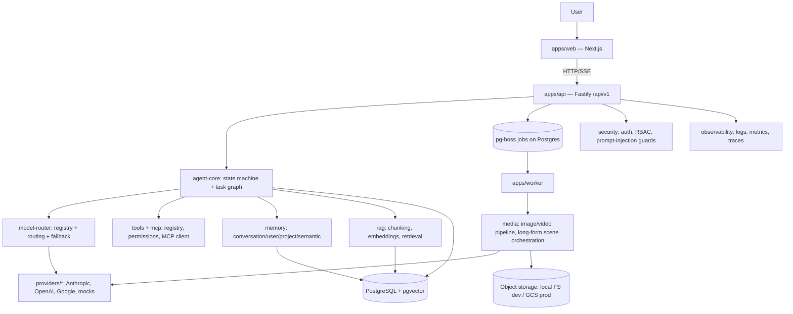

# Final System Spec

**Status: target-state specification, drafted at the end of Phase 0 (2026-08-31).** This is the design the roadmap in [[25_IMPLEMENTATION_ROADMAP]] builds toward, synthesized from every doc in this folder. It is explicitly **not** a completion report — [[29_FEATURE_MATRIX]] tracks actual status per capability, and this file is re-validated against the real implementation at program completion (Phase 15), with any drift between design and what was actually built called out there, not hidden.

## One-paragraph description

A TypeScript/Node.js monorepo ([[24_PROJECT_STRUCTURE]]) providing a model-agnostic AI agent platform: a Next.js web app and a versioned HTTP/SSE API ([[15_API_ARCHITECTURE]], [[16_FRONTEND_ARCHITECTURE]]) in front of an agent core with an explicit state machine and task graph ([[11_AGENT_LOOP]]), a tool/MCP layer with risk-tiered permissions ([[10_TOOL_AND_MCP_ARCHITECTURE]]), multi-level memory and RAG ([[08_MEMORY_ARCHITECTURE]], [[09_RAG_ARCHITECTURE]]), and mock-first image/video generation with a real long-form video orchestration pipeline ([[05_IMAGE_GENERATION_RESEARCH]]–[[07_LONG_RUNNING_JOB_ARCHITECTURE]]), all persisted to a single PostgreSQL instance ([[14_DATABASE_ARCHITECTURE]]) reachable via pg-boss-backed async jobs, secured per [[13_SECURITY_ARCHITECTURE]], observable per [[20_OBSERVABILITY]], and deployable to Google Cloud Run ([[18_CLOUD_ARCHITECTURE]], [[19_DEPLOYMENT_ARCHITECTURE]]) once explicitly authorized.

## System diagram

## What is real vs. mocked at target state (see [[29_FEATURE_MATRIX]] for current, not target, status)

- **Real, provider-swappable:** text/reasoning chat, agent task execution, coding agent, tool calling, MCP, memory, RAG, auth, jobs, observability, the API and web UI.
- **Real interface, mock implementation until credentials exist ([[26_DECISIONS]] ADR-009):** image generation, video generation, long-form video. The orchestration (scene decomposition, job persistence, resumability, ffmpeg assembly) is real and fully exercised by the mock providers — only the actual pixel/video generation call is mocked.
- **Documented, not provisioned ([[26_DECISIONS]] ADR-011):** cloud deployment. IaC and Dockerfiles are real artifacts; no live GCP environment exists until explicitly authorized.

## Known, accepted limitations at target state (see [[27_RISKS_AND_LIMITATIONS]] for the full list)

No provider generates a 20+ minute video in one call (industry-wide, not our limitation) — long-form video is always scene-decomposed. Cross-scene character/visual consistency is best-effort. Prompt injection is mitigated, not eliminated. RAG retrieval quality is bounded by chunking/embedding choices. These are stated in product-facing terms too, not just here, per this project's own honesty principle ([[00_PROJECT_VISION]]).

## How to tell if the real system matches this spec

At Phase 15, re-read this file section by section against the actual repository: does `packages/model-router` actually implement the fallback design in [[12_MODEL_ROUTING]]? Does the agent execution UI actually render the state machine live? Does a deliberately-failed video scene actually only regenerate that scene? Each divergence found gets a line in `/docs/FINAL_AUDIT.md`, categorized by severity, not silently reconciled by editing this spec to match whatever was actually built.
